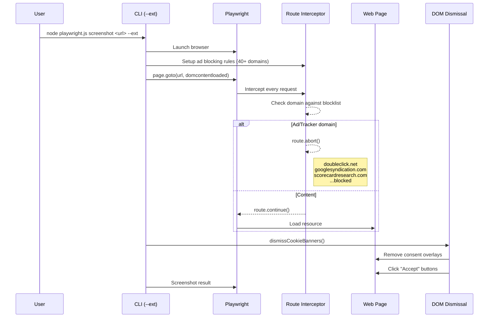
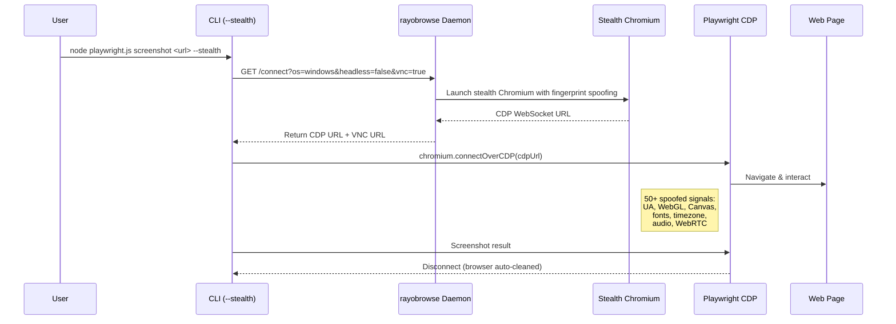
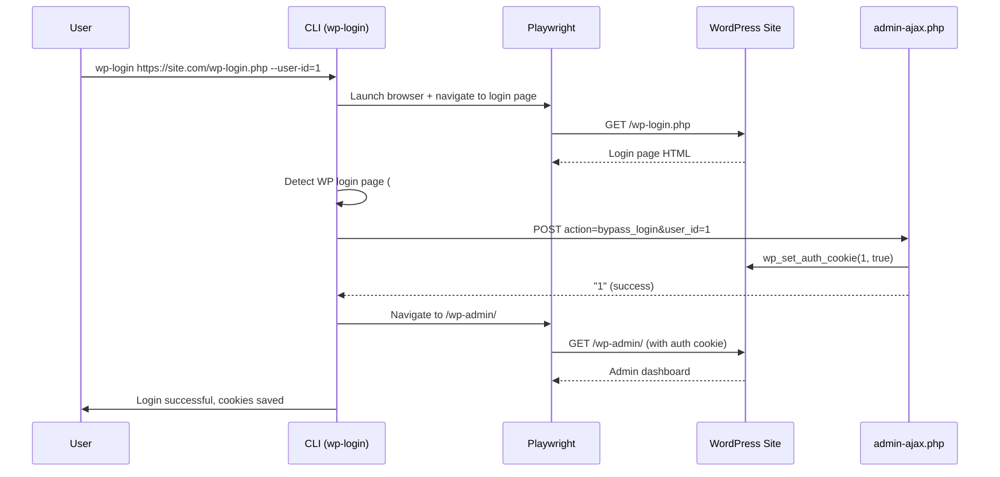
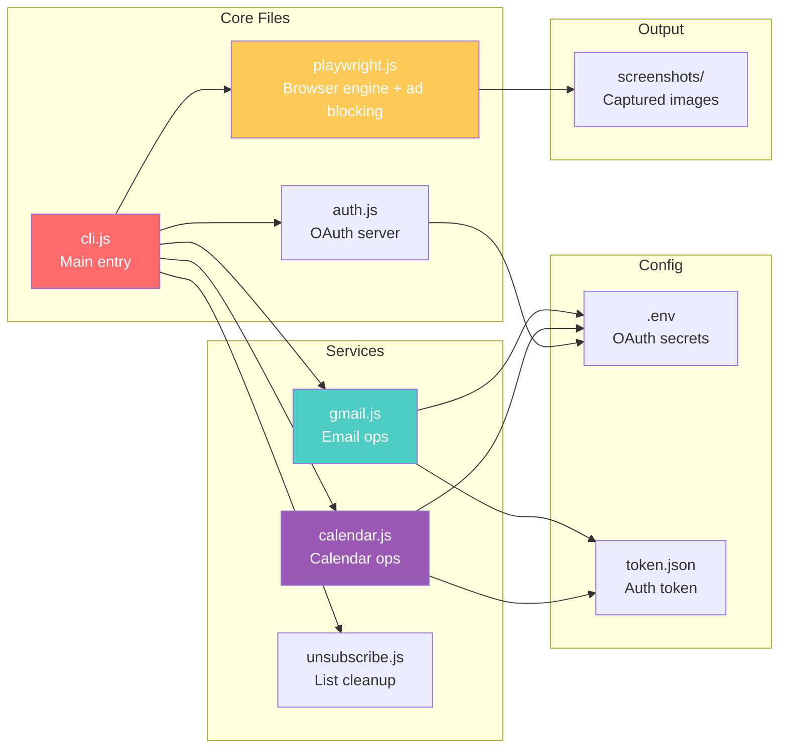
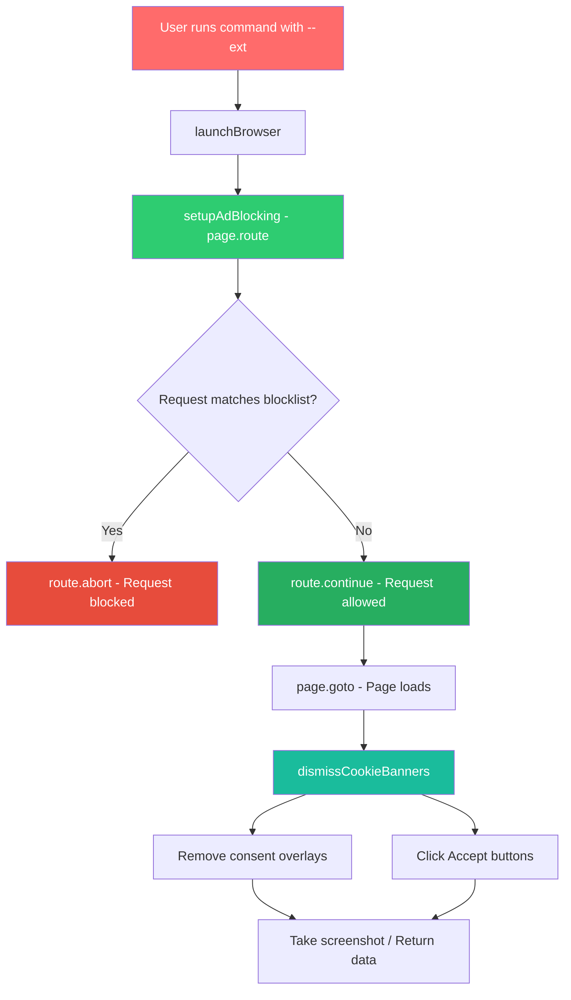

# System Automation

Gmail, Calendar, and Playwright browser automation CLI with cross-browser support (Chromium, Firefox, WebKit), built-in ad/tracker blocking, automatic cookie banner dismissal, and stealth browser integration via [rayobrowse](https://github.com/rayobyte-data/rayobrowse).

## Quick Start

```bash
npm install
npx playwright install          # Install browser engines
node cli.js auth                # Authenticate with Google
node cli.js gmail list          # View emails
node cli.js browser open https://example.com
node cli.js browser screenshot https://example.com page.png --ext  # With ad blocking
node cli.js browser screenshot https://example.com page.png --stealth  # With stealth browser
```

## Feature Tree

```mermaid
graph TD
    SA[System Automation CLI] --> GMAIL[Gmail]
    SA --> CAL[Calendar]
    SA --> BROWSER[Browser - Playwright]
    SA --> PROTECT[Privacy & Protection]
    SA --> OTHER[Other]

    GMAIL --> G1[list - View emails]
    GMAIL --> G2[send - Send email]
    GMAIL --> G3[clear - Delete emails]
    GMAIL --> G4[unsubscribe - Cleanup lists]

    CAL --> C1[list - View events]
    CAL --> C2[create - Add event]
    CAL --> C3[delete - Remove event]
    CAL --> C4[free - Find slots]

    BROWSER --> NAV[Navigation]
    BROWSER --> SS[Screenshots]
    BROWSER --> ME[Mouse Emulation]
    BROWSER --> ADV[Advanced]

    NAV --> N1[open - Navigate]
    NAV --> N2[text - Extract text]
    NAV --> N3[fill - Form submission]
    NAV --> N4[exec - Run JavaScript]
    NAV --> N5[download - Save HTML]
    NAV --> N6[cookies - Get cookies]
    NAV --> N7[headers - Meta tags]
    NAV --> N8[tabs - Multi-tab]

    SS --> S1[screenshot - Full page]
    SS --> S2[viewport - Custom size]
    SS --> S3[element - Screenshot element]
    SS --> S4[clip - Clipped region]
    SS --> S5[compare - Side by side]
    SS --> S6[pdf - Save as PDF]
    SS --> S7[multi-shot - Timed series]
    SS --> S8[cross-browser - Test all]

    ME --> M1[move - Bezier curve]
    ME --> M2[click - Click at xy]
    ME --> M3[double-click]
    ME --> M4[right-click]
    ME --> M5[drag - Drag path]
    ME --> M6[hover - Hold position]
    ME --> M7[scroll - Mouse wheel]
    ME --> M8[path - Waypoints]
    ME --> M9[wiggle - Human idle]

    ADV --> A1[a11y - Accessibility tree]
    ADV --> A2[intercept - Block resources]

    PROTECT --> P1[--ext flag]
    P1 --> P2[Ad/Tracker Blocking]
    P1 --> P3[Cookie Banner Dismissal]
    P2 --> P4[40+ tracker domains blocked]
    P2 --> P5[Route-level interception]
    P3 --> P6[Auto-remove consent elements]
    P3 --> P7[Auto-click Accept buttons]

    OTHER --> O1[auth - Google OAuth]
    OTHER --> O2[unsubscribe - Mailing lists]

    style SA fill:#ff6b6b,stroke:#333,color:white
    style GMAIL fill:#4ecdc4,stroke:#333,color:white
    style CAL fill:#9b59b6,stroke:#333,color:white
    style BROWSER fill:#feca57,stroke:#333,color:white
    style PROTECT fill:#2ecc71,stroke:#333,color:white
    style NAV fill:#45b7d1,stroke:#333,color:white
    style SS fill:#96ceb4,stroke:#333,color:white
    style ME fill:#ff9ff3,stroke:#333,color:white
    style ADV fill:#c39bd3,stroke:#333,color:white
    style OTHER fill:#54a0ff,stroke:#333,color:white
    style P1 fill:#27ae60,stroke:#333,color:white
    style P2 fill:#1abc9c,stroke:#333,color:white
    style P3 fill:#16a085,stroke:#333,color:white
```



## Privacy & Ad Blocking (`--ext`)

The `--ext` flag enables built-in ad/tracker blocking and cookie banner dismissal using Playwright's request interception — no external extensions required.

### How It Works



### Blocked Domains (40+)

Ad networks, trackers, and analytics services blocked via `page.route()`:

| Category | Domains |
|----------|---------|
| **Ad Networks** | doubleclick.net, googlesyndication.com, googleadservices.com, pagead2.googlesyndication.com, adservice.google.com, adnxs.com, pubmatic.com, openx.net, sharethrough.com, teads.tv |
| **Analytics** | google-analytics.com, scorecardresearch.com, quantserve.com, chartbeat.com, parsely.com, permutive.com |
| **Tracking** | demdex.net, everesttech.net, rubiconproject.com, bluekai.com, bidswitch.net, casalemedia.com, criteo.com, criteo.net |
| **Social** | facebook.com/tr, analytics.twitter.com, ads.twitter.com, ads.linkedin.com, bat.bing.com |
| **Content Ads** | taboola.com, outbrain.com, moatads.com, amazon-adsystem.com |
| **Session Replay** | hotjar.com, mouseflow.com, crazyegg.com, fullstory.com, clarity.ms |
| **Error Tracking** | sentry.io, newrelic.com, nr-data.net |
| **A/B Testing** | optimizely.com |
| **Other** | contextweb.com, spotxchange.com, lijit.com, sail-horizon.com, bounceexchange.com, imrworldwide.com |

### Cookie Banner Dismissal

Automatic removal of common cookie consent overlays:

| Provider | Selectors |
|----------|-----------|
| **CookieBot** | `#CybotCookiebotDialog` |
| **OneTrust** | `[class*="onetrust"]`, `[id*="onetrust"]` |
| **Osano** | `[class*="osano"]`, `[id*="osano"]` |
| **Iubenda** | `[class*="iubenda"]`, `[id*="iubenda"]` |
| **Generic** | `[class*="cookie-consent"]`, `[class*="cookie-banner"]`, `[class*="consent-popup"]`, `[aria-label*="cookie"]` |

Auto-clicks buttons matching: "Accept All", "Accept Cookies", "Allow All", "I Agree", "Got It", "OK", "Close", "Dismiss", "Continue", "Understood", and more.

### Performance Proof

CNN.com with and without `--ext`:

| Metric | Without | With `--ext` | Reduction |
|--------|---------|-------------|-----------|
| Page size | 4,288 KB | 463 KB | **90%** |
| Ad/tracker requests | 13 | 0 | **100%** |
| Total requests | 184 | 174 | 5% |

## Stealth Browser Mode (`--stealth`)

The `--stealth` flag connects to [rayobrowse](https://github.com/rayobyte-data/rayobrowse) — a Docker-based stealth Chromium browser that passes anti-bot detection (Cloudflare, Akamai, PerimeterX, BrowserScan, PixelScan).

### Setup

```bash
# Clone and start rayobrowse
git clone https://github.com/rayobyte-data/rayobrowse.git
cd rayobrowse
docker compose up -d

# Verify it's running
curl http://localhost:9222/health
```

### Usage

```bash
node playwright.js screenshot https://example.com page.png --stealth
node playwright.js open https://example.com --stealth
node playwright.js stealth-health  # Check daemon status
```

### How It Works



### What rayobrowse Spoofs

| Category | Signals |
|----------|---------|
| **Browser** | User agent, version, client hints, platform, plugins, MIME types |
| **Graphics** | WebGL vendor/renderer/extensions, canvas output, text rendering |
| **Audio** | AudioContext fingerprint, audio processing |
| **Fonts** | OS-matched fonts, font rendering behavior |
| **Network** | WebRTC, DNS leaks, proxy alignment, Accept-Language |
| **Automation** | CDP artifacts, launch flags, headless/headful consistency |
| **OS** | Timezone, locale, language, hardware concurrency, touch support |
| **Mouse** | Human-like movement and click timing |

### Supported Anti-Bot Systems

| System | Status |
|--------|--------|
| Cloudflare | ✅ |
| Akamai | ✅ |
| PerimeterX / HUMAN | ✅ |
| BrowserScan | ✅ |
| PixelScan | ✅ |
| demo.fingerprint.com | ✅ |

### Combining Flags

```bash
# Stealth + ad blocking (best protection)
node playwright.js screenshot https://example.com page.png --stealth --ext

# Stealth + custom browser
node playwright.js open https://example.com --stealth firefox
```

## Browser Commands (Playwright)

All browser commands support cross-browser testing. Append `chromium`, `firefox`, or `webkit` to any command:

```bash
node cli.js browser open https://example.com chromium   # Default
node cli.js browser open https://example.com firefox    # Firefox
node cli.js browser open https://example.com webkit     # Safari engine
```

Add `--ext` to any command for ad blocking + cookie dismissal, or `--stealth` for anti-bot evasion:

```bash
node cli.js browser screenshot https://example.com page.png --ext
node cli.js browser screenshot https://example.com page.png --stealth
node cli.js browser open https://example.com --ext --stealth  # Both
```

### Navigation

| Command | Description |
|---------|-------------|
| `browser open <url>` | Navigate and print title |
| `browser text <url>` | Extract page text |
| `browser fill <url> <sel> <val>` | Fill form and submit |
| `browser exec <url> <js>` | Run JavaScript in page |
| `browser download <url>` | Save page HTML |
| `browser cookies <url>` | Get page cookies |
| `browser headers <url>` | Get meta tags |
| `browser tabs <url1> <url2>` | Open multiple tabs |

### Screenshots

| Command | Description |
|---------|-------------|
| `browser screenshot <url>` | Full-page screenshot |
| `browser viewport <url> 375x667` | Mobile viewport |
| `browser element <url> #logo` | Screenshot element |
| `browser clip <url> '{"x":0,"y":0,"width":500,"height":500}'` | Clipped region |
| `browser compare <url1> <url2>` | Side-by-side comparison |
| `browser pdf <url>` | Save as PDF |
| `browser multi-shot <url> 5 1000` | 5 screenshots, 1s apart |
| `browser cross-browser <url>` | Test all 3 browsers |

### Mouse Emulation

| Command | Description |
|---------|-------------|
| `browser move <url> 100 100 500 400` | Bezier curve movement |
| `browser click <url> 400 300` | Click at coordinates |
| `browser double-click <url> 400 300` | Double-click |
| `browser right-click <url> 400 300` | Right-click |
| `browser drag <url> 100 100 500 300` | Drag with bezier path |
| `browser hover <url> 400 300 2000` | Hover for 2 seconds |
| `browser scroll <url> 400 300 0 500` | Scroll down 500px |
| `browser path <url> 100,100 200,200 300,100` | Move through points |
| `browser wiggle <url> 400 300 25 1500` | Wiggle for 1.5s |

### Advanced

| Command | Description |
|---------|-------------|
| `browser a11y <url>` | Accessibility tree |
| `browser intercept <url> image,css` | Block resources |

### WordPress Login Bypass

Bypass WordPress login pages using AJAX (requires [bypass-login](https://wordpress.org/plugins/bypass-login/) plugin) or form-based credentials.

| Command | Description |
|---------|-------------|
| `browser wp-login <url> --user-id=1` | Login as user ID (AJAX bypass) |
| `browser wp-login <url> --username=admin --password=pass` | Login with credentials (form fallback) |
| `browser wp-users <url>` | List available users on login page |



## Gmail Commands

| Command | Description |
|---------|-------------|
| `gmail list [count]` | List recent emails |
| `gmail send <to> <subject> <body>` | Send email |
| `gmail clear` | Delete first 100 emails |

## Calendar Commands

| Command | Description |
|---------|-------------|
| `calendar list [count]` | List upcoming events |
| `calendar create <title> <start> <end>` | Create event |
| `calendar delete <eventId>` | Delete event |
| `calendar free [date]` | Find free slots |

## File Structure



## Architecture



## Dependencies

- **playwright** — Cross-browser automation (Chromium, Firefox, WebKit)
- **puppeteer** — Legacy Chrome automation (kept for compatibility)
- **googleapis** — Gmail and Calendar APIs
- **dotenv** — Environment variable loading
- **express** — OAuth callback server

## Attribution

- **Stealth Browser** — [rayobrowse](https://github.com/rayobyte-data/rayobrowse) (MIT) by Rayobyte. Stealth Chromium browser with 50+ spoofed fingerprint signals for anti-bot evasion.
- **Ad/Tracker Domain List** — Inspired by [uBlock Origin](https://github.com/gorhill/uBlock) filter lists (GPL-3.0). Domain list curated from EasyList, EasyPrivacy, and uBlock Origin's built-in filters.
- **Cookie Banner Selectors** — Inspired by [No Cookie Banners](https://github.com/JeannedArk/no-cookie-banners-browser-extension) (MIT). Selector patterns adapted from their content script.
- **Mouse Emulation** — Bezier curve algorithm for natural mouse movement paths.
- **Playwright** — [Microsoft Playwright](https://github.com/microsoft/playwright) (Apache-2.0) for cross-browser automation.

## License

MIT
