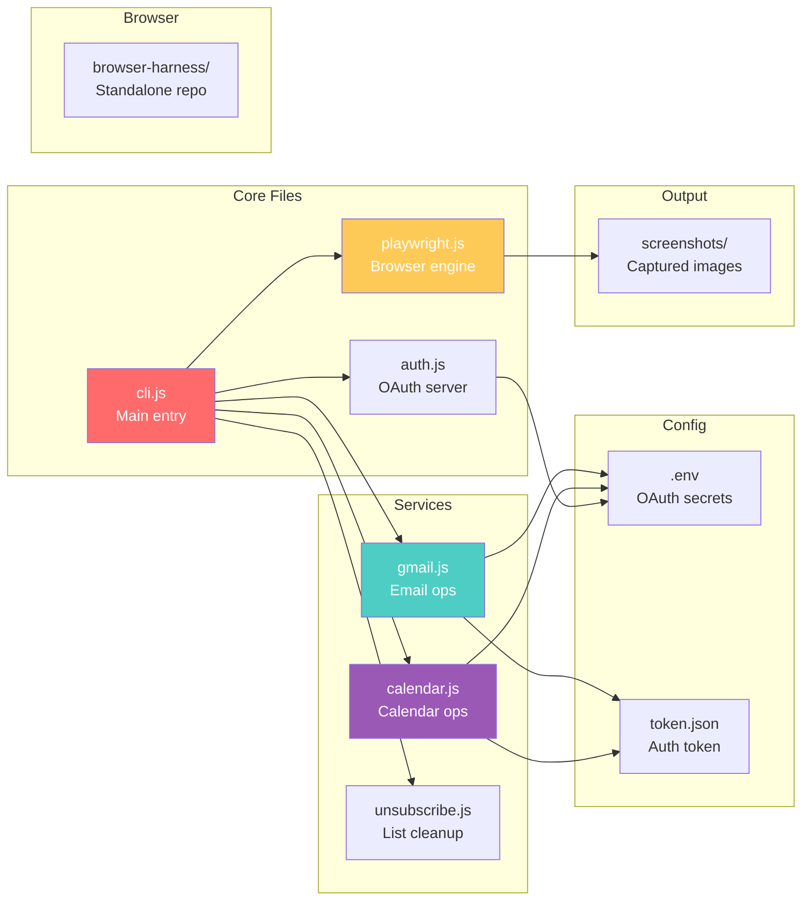

# System Automation

Gmail, Calendar, and Playwright browser automation CLI with cross-browser support (Chromium, Firefox, WebKit).

## Quick Start

```bash
npm install
npx playwright install          # Install browser engines
node cli.js auth                # Authenticate with Google
node cli.js gmail list          # View emails
node cli.js browser open https://example.com
```

## Feature Tree

```mermaid
graph TD
    SA[System Automation CLI] --> GMAIL[Gmail]
    SA --> CAL[Calendar]
    SA --> BROWSER[Browser - Playwright]
    SA --> OTHER[Other]

    GMAIL --> G1[list - View emails]
    GMAIL --> G2[send - Send email]
    GMAIL --> G3[clear - Delete emails]
    GMAIL --> G4[unsubscribe - Cleanup lists]

    CAL --> C1[list - View events]
    CAL --> C2[create - Add event]
    CAL --> C3[delete - Remove event]
    CAL --> C4[free - Find slots]

    BROWSER --> NAV[Navigation]
    BROWSER --> SS[Screenshots]
    BROWSER --> ME[Mouse Emulation]
    BROWSER --> ADV[Advanced]

    NAV --> N1[open - Navigate]
    NAV --> N2[text - Extract text]
    NAV --> N3[fill - Form submission]
    NAV --> N4[exec - Run JavaScript]
    NAV --> N5[download - Save HTML]
    NAV --> N6[cookies - Get cookies]
    NAV --> N7[headers - Meta tags]
    NAV --> N8[tabs - Multi-tab]

    SS --> S1[screenshot - Full page]
    SS --> S2[viewport - Custom size]
    SS --> S3[element - Screenshot element]
    SS --> S4[clip - Clipped region]
    SS --> S5[compare - Side by side]
    SS --> S6[pdf - Save as PDF]
    SS --> S7[multi-shot - Timed series]
    SS --> S8[cross-browser - Test all]

    ME --> M1[move - Bezier curve]
    ME --> M2[click - Click at xy]
    ME --> M3[double-click]
    ME --> M4[right-click]
    ME --> M5[drag - Drag path]
    ME --> M6[hover - Hold position]
    ME --> M7[scroll - Mouse wheel]
    ME --> M8[path - Waypoints]
    ME --> M9[wiggle - Human idle]

    ADV --> A1[a11y - Accessibility tree]
    ADV --> A2[intercept - Block resources]

    OTHER --> O1[auth - Google OAuth]
    OTHER --> O2[unsubscribe - Mailing lists]

    style SA fill:#ff6b6b,stroke:#333,color:white
    style GMAIL fill:#4ecdc4,stroke:#333,color:white
    style CAL fill:#9b59b6,stroke:#333,color:white
    style BROWSER fill:#feca57,stroke:#333,color:white
    style NAV fill:#45b7d1,stroke:#333,color:white
    style SS fill:#96ceb4,stroke:#333,color:white
    style ME fill:#ff9ff3,stroke:#333,color:white
    style ADV fill:#c39bd3,stroke:#333,color:white
    style OTHER fill:#54a0ff,stroke:#333,color:white
```



## Browser Commands (Playwright)

All browser commands support cross-browser testing. Append `chromium`, `firefox`, or `webkit` to any command:

```bash
node cli.js browser open https://example.com chromium   # Default
node cli.js browser open https://example.com firefox    # Firefox
node cli.js browser open https://example.com webkit     # Safari engine
```

### Navigation

| Command | Description |
|---------|-------------|
| `browser open <url>` | Navigate and print title |
| `browser text <url>` | Extract page text |
| `browser fill <url> <sel> <val>` | Fill form and submit |
| `browser exec <url> <js>` | Run JavaScript in page |
| `browser download <url>` | Save page HTML |
| `browser cookies <url>` | Get page cookies |
| `browser headers <url>` | Get meta tags |
| `browser tabs <url1> <url2>` | Open multiple tabs |

### Screenshots

| Command | Description |
|---------|-------------|
| `browser screenshot <url>` | Full-page screenshot |
| `browser viewport <url> 375x667` | Mobile viewport |
| `browser element <url> #logo` | Screenshot element |
| `browser clip <url> '{"x":0,"y":0,"width":500,"height":500}'` | Clipped region |
| `browser compare <url1> <url2>` | Side-by-side comparison |
| `browser pdf <url>` | Save as PDF |
| `browser multi-shot <url> 5 1000` | 5 screenshots, 1s apart |
| `browser cross-browser <url>` | Test all 3 browsers |

### Mouse Emulation

| Command | Description |
|---------|-------------|
| `browser move <url> 100 100 500 400` | Bezier curve movement |
| `browser click <url> 400 300` | Click at coordinates |
| `browser double-click <url> 400 300` | Double-click |
| `browser right-click <url> 400 300` | Right-click |
| `browser drag <url> 100 100 500 300` | Drag with bezier path |
| `browser hover <url> 400 300 2000` | Hover for 2 seconds |
| `browser scroll <url> 400 300 0 500` | Scroll down 500px |
| `browser path <url> 100,100 200,200 300,100` | Move through points |
| `browser wiggle <url> 400 300 25 1500` | Wiggle for 1.5s |

### Advanced

| Command | Description |
|---------|-------------|
| `browser a11y <url>` | Accessibility tree |
| `browser intercept <url> image,css` | Block resources |

## Gmail Commands

| Command | Description |
|---------|-------------|
| `gmail list [count]` | List recent emails |
| `gmail send <to> <subject> <body>` | Send email |
| `gmail clear` | Delete first 100 emails |

## Calendar Commands

| Command | Description |
|---------|-------------|
| `calendar list [count]` | List upcoming events |
| `calendar create <title> <start> <end>` | Create event |
| `calendar delete <eventId>` | Delete event |
| `calendar free [date]` | Find free slots |

## File Structure



## Dependencies

- **playwright** — Cross-browser automation (Chromium, Firefox, WebKit)
- **puppeteer** — Legacy Chrome automation (kept for compatibility)
- **googleapis** — Gmail and Calendar APIs
- **dotenv** — Environment variable loading
- **express** — OAuth callback server

## License

MIT
