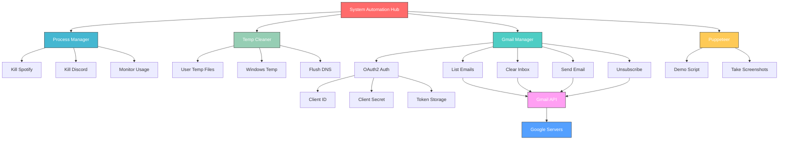
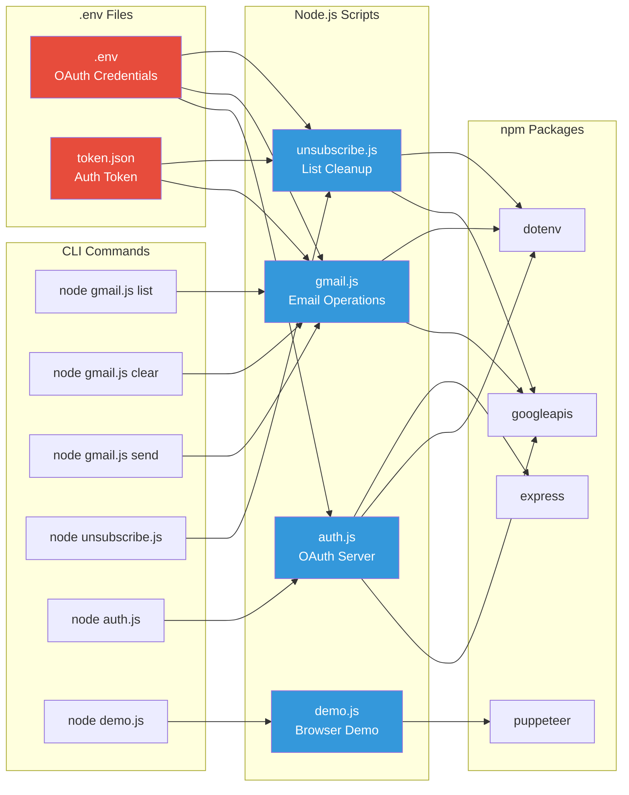
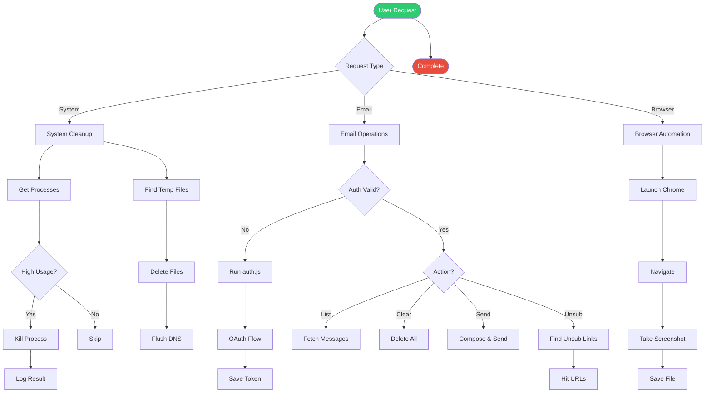

# System Automation

Gmail automation, Puppeteer browser control, and system cleanup tools.

## Quick Start

```bash
npm install
node auth.js          # Authenticate with Google
node gmail.js list    # View emails
node gmail.js clear   # Delete all emails
node unsubscribe.js   # Unsubscribe from mailing lists
```

## System Automation Link Tree



## File & Dependency Graph



## Request Flow


