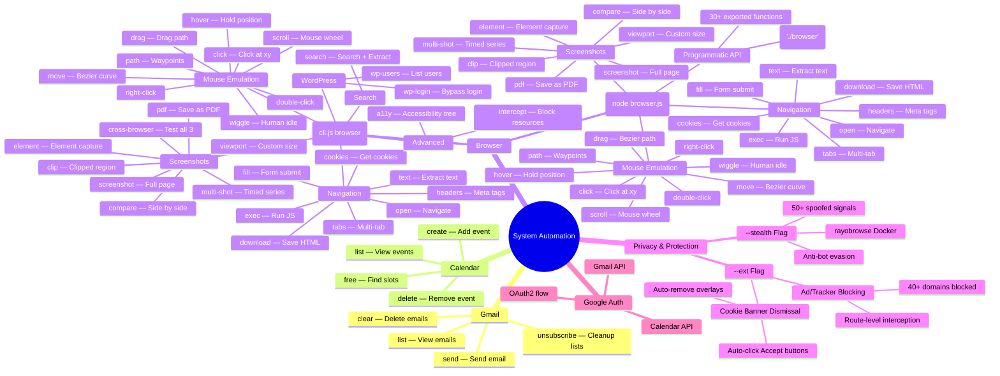
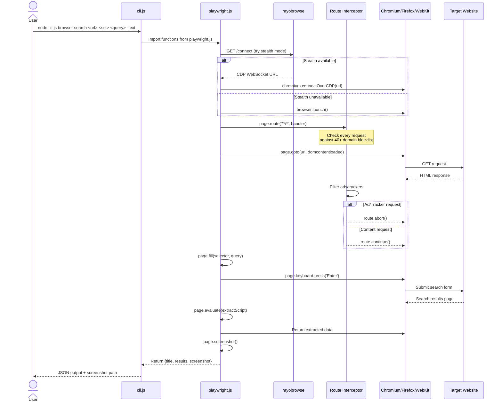
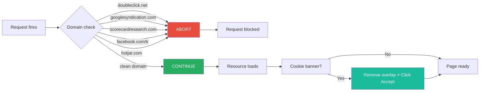
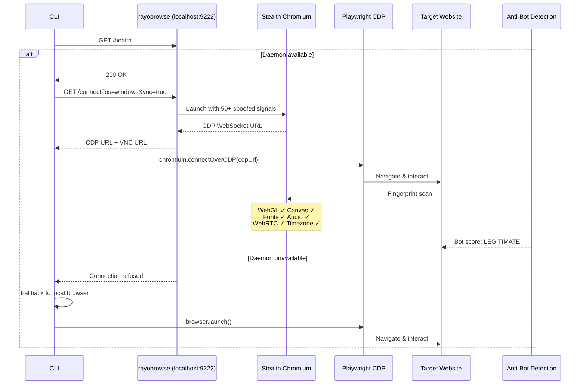
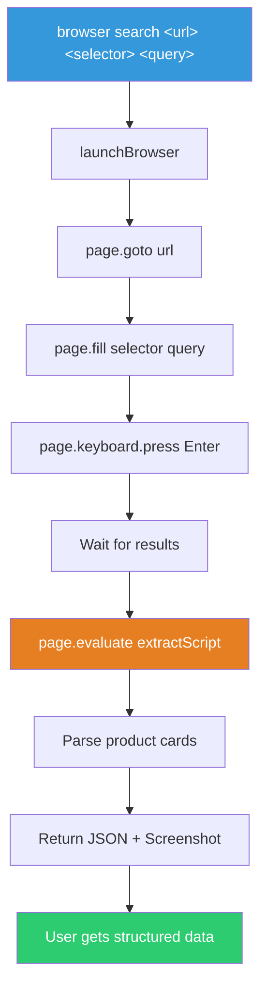
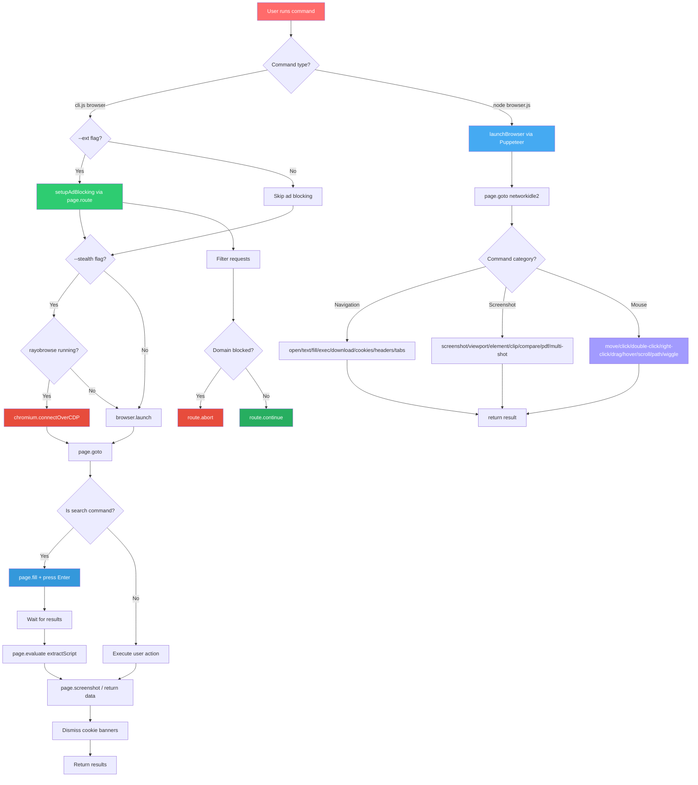

# System Automation

Gmail, Calendar, and dual-engine browser automation CLI with cross-browser support (Chromium, Firefox, WebKit), Puppeteer-based full browser harness, built-in ad/tracker blocking, automatic cookie banner dismissal, stealth browser integration, and site search with data extraction.

## Quick Start

```bash
npm install
npx playwright install              # Install Playwright browser engines

# Google
node cli.js auth                    # Authenticate with Google
node cli.js gmail list              # View emails

# Playwright engine (advanced: stealth, ad blocking, search)
node cli.js browser open https://example.com
node cli.js browser screenshot https://example.com page.png --ext
node cli.js browser search https://www.amazon.com "#twotabsearchtextbox" "server parts" --ext

# Puppeteer engine (standalone: mouse emulation, screenshots, multi-tab)
node browser.js open https://example.com
node browser.js screenshot https://example.com page.png
node browser.js move https://example.com 100 100 500 400
```

## Feature Map



## How Commands Flow



## Privacy & Ad Blocking (`--ext`)

The `--ext` flag enables built-in ad/tracker blocking and cookie banner dismissal using Playwright's request interception — no external extensions required.

### How It Works



### Blocked Domains (40+)

| Category | Domains |
|----------|---------|
| **Ad Networks** | doubleclick.net, googlesyndication.com, googleadservices.com, pagead2.googlesyndication.com, adservice.google.com, adnxs.com, pubmatic.com, openx.net, sharethrough.com, teads.tv |
| **Analytics** | google-analytics.com, scorecardresearch.com, quantserve.com, chartbeat.com, parsely.com, permutive.com |
| **Tracking** | demdex.net, everesttech.net, rubiconproject.com, bluekai.com, bidswitch.net, casalemedia.com, criteo.com, criteo.net |
| **Social** | facebook.com/tr, analytics.twitter.com, ads.twitter.com, ads.linkedin.com, bat.bing.com |
| **Content Ads** | taboola.com, outbrain.com, moatads.com, amazon-adsystem.com |
| **Session Replay** | hotjar.com, mouseflow.com, crazyegg.com, fullstory.com, clarity.ms |
| **Error Tracking** | sentry.io, newrelic.com, nr-data.net |
| **A/B Testing** | optimizely.com |
| **Other** | contextweb.com, spotxchange.com, lijit.com, sail-horizon.com, bounceexchange.com, imrworldwide.com |

### Cookie Banner Dismissal

| Provider | Selectors |
|----------|-----------|
| **CookieBot** | `#CybotCookiebotDialog` |
| **OneTrust** | `[class*="onetrust"]`, `[id*="onetrust"]` |
| **Osano** | `[class*="osano"]`, `[id*="osano"]` |
| **Iubenda** | `[class*="iubenda"]`, `[id*="iubenda"]` |
| **Generic** | `[class*="cookie-consent"]`, `[class*="cookie-banner"]`, `[class*="consent-popup"]`, `[aria-label*="cookie"]` |

Auto-clicks: "Accept All", "Accept Cookies", "Allow All", "I Agree", "Got It", "OK", "Close", "Dismiss", "Continue", "Understood"

### Performance Proof (CNN.com)

| Metric | Without | With `--ext` | Reduction |
|--------|---------|-------------|-----------|
| Page size | 4,288 KB | 463 KB | **90%** |
| Ad/tracker requests | 13 | 0 | **100%** |
| Total requests | 184 | 174 | 5% |

## Stealth Browser Mode (Always-On)

Stealth mode is enabled by default. Every browser command tries [rayobrowse](https://github.com/rayobyte-data/rayobrowse) first, then falls back to a local browser if unavailable. Use `--no-stealth` to disable.

### How It Works



### What rayobrowse Spoofs

| Category | Signals |
|----------|---------|
| **Browser** | User agent, version, client hints, platform, plugins, MIME types |
| **Graphics** | WebGL vendor/renderer/extensions, canvas output, text rendering |
| **Audio** | AudioContext fingerprint, audio processing |
| **Fonts** | OS-matched fonts, font rendering behavior |
| **Network** | WebRTC, DNS leaks, proxy alignment, Accept-Language |
| **Automation** | CDP artifacts, launch flags, headless/headful consistency |
| **OS** | Timezone, locale, language, hardware concurrency, touch support |
| **Mouse** | Human-like movement and click timing |

### Supported Anti-Bot Systems

| System | Status |
|--------|--------|
| Cloudflare | Passes |
| Akamai | Passes |
| PerimeterX / HUMAN | Passes |
| BrowserScan | Passes |
| PixelScan | Passes |
| demo.fingerprint.com | Passes |

### Setup rayobrowse

```bash
docker compose up -d               # Start daemon
curl http://localhost:9222/health   # Verify
node cli.js stealth-health         # Check from CLI
node cli.js browser open https://example.com  # Stealth is default
node cli.js browser open https://example.com --no-stealth  # Disable
```

## Site Search & Data Extraction

The `search` command fills a search box, submits the form, and extracts structured data from results — all in one command.



### Usage

```bash
# Amazon — search and extract products
node cli.js browser search "https://www.amazon.com" "#twotabsearchtextbox" "server motherboard" --ext

# eBay
node cli.js browser search "https://www.ebay.com" "#gh-ac" "server cpu" --ext

# Newegg
node cli.js browser search "https://www.newegg.com" "#product-search" "server ram" --ext

# Generic — works on any site with a search form
node cli.js browser search "https://example.com" "input[name=q]" "search term" --ext
```

### Example Output

```json
{
  "title": "Amazon.com : server motherboard",
  "results": [
    {
      "title": "ASUS Pro WS W680-ACE IPMI LGA1700 ATX",
      "price": "£296.08",
      "rating": "4.4 out of 5 stars",
      "asin": "B0BZGKKCWC"
    },
    {
      "title": "MACHINIST X99 Dual CPU LGA2011-V3",
      "price": "£142.41",
      "rating": "3.7 out of 5 stars",
      "asin": "B0CT3HDPPQ"
    }
  ],
  "screenshot": "screenshots/search-1784831867045.png"
}
```

### Custom Extraction Scripts

For non-Amazon sites, pass a custom extraction script via `exec` after the search:

```bash
# Search on eBay, then extract with custom JS
node cli.js browser fill "https://www.ebay.com" "#gh-ac" "server ram" --ext
node cli.js browser exec "https://www.ebay.com/s.html" "JSON.stringify(Array.from(document.querySelectorAll('.s-item')).slice(0,10).map(el => ({title: el.querySelector('.s-item__title')?.textContent, price: el.querySelector('.s-item__price')?.textContent})))" --ext
```

## Browser Commands

All commands support `chromium`, `firefox`, `webkit` as the last argument:

```bash
node cli.js browser open https://example.com firefox
node cli.js browser screenshot https://example.com page.png webkit
```

### Navigation

| Command | Description |
|---------|-------------|
| `browser open <url>` | Navigate and print title |
| `browser text <url>` | Extract page text |
| `browser fill <url> <sel> <val>` | Fill form and submit |
| `browser exec <url> <js>` | Run JavaScript in page |
| `browser download <url>` | Save page HTML |
| `browser cookies <url>` | Get page cookies |
| `browser headers <url>` | Get meta tags |
| `browser tabs <url1> <url2>` | Open multiple tabs |

### Screenshots

| Command | Description |
|---------|-------------|
| `browser screenshot <url>` | Full-page screenshot |
| `browser viewport <url> 375x667` | Mobile viewport |
| `browser element <url> #logo` | Screenshot element |
| `browser clip <url> '{"x":0,"y":0,"width":500,"height":500}'` | Clipped region |
| `browser compare <url1> <url2>` | Side-by-side comparison |
| `browser pdf <url>` | Save as PDF |
| `browser multi-shot <url> 5 1000` | 5 screenshots, 1s apart |
| `browser cross-browser <url>` | Test all 3 browsers |

### Mouse Emulation

| Command | Description |
|---------|-------------|
| `browser move <url> 100 100 500 400` | Bezier curve movement |
| `browser click <url> 400 300` | Click at coordinates |
| `browser double-click <url> 400 300` | Double-click |
| `browser right-click <url> 400 300` | Right-click |
| `browser drag <url> 100 100 500 300` | Drag with bezier path |
| `browser hover <url> 400 300 2000` | Hover for 2 seconds |
| `browser scroll <url> 400 300 0 500` | Scroll down 500px |
| `browser path <url> 100,100 200,200 300,100` | Move through points |
| `browser wiggle <url> 400 300 25 1500` | Wiggle for 1.5s |

### Advanced

| Command | Description |
|---------|-------------|
| `browser a11y <url>` | Accessibility tree |
| `browser intercept <url> image,css` | Block resources |

### WordPress Login Bypass

| Command | Description |
|---------|-------------|
| `browser wp-login <url> --user-id=1` | AJAX bypass (requires [bypass-login](https://wordpress.org/plugins/bypass-login/) plugin) |
| `browser wp-login <url> --username=admin --password=pass` | Form login fallback |
| `browser wp-users <url>` | List available users on login page |

## Puppeteer Browser Engine (`browser.js`)

A standalone 670-line Puppeteer-based browser harness with 30+ exported functions, bezier-curve mouse emulation, and a CLI router. Run directly with `node browser.js <command>` or import programmatically via `require('./browser')`.

### Commands

```bash
node browser.js <command> [args]

# Navigation
node browser.js open https://example.com
node browser.js text https://example.com
node browser.js fill https://google.com '[name=q]' 'search term'
node browser.js exec https://example.com 'document.title'
node browser.js download https://example.com page.html
node browser.js cookies https://example.com
node browser.js headers https://example.com
node browser.js tabs https://google.com https://github.com

# Screenshots
node browser.js screenshot https://example.com page.png
node browser.js viewport https://example.com mobile.png 375x667
node browser.js element https://example.com logo.png '#logo'
node browser.js clip https://example.com part.png '{"x":0,"y":0,"width":500,"height":500}'
node browser.js compare https://google.com https://bing.com
node browser.js pdf https://example.com page.pdf
node browser.js multi-shot https://example.com 5 2000

# Mouse Emulation (bezier curves)
node browser.js move https://example.com 100 100 500 400 30
node browser.js click https://example.com 400 300 left
node browser.js double-click https://example.com 400 300
node browser.js right-click https://example.com 400 300
node browser.js drag https://example.com 100 100 500 300
node browser.js hover https://example.com 400 300 2000
node browser.js scroll https://example.com 400 300 0 500
node browser.js path https://example.com 100,100 200,200 300,100
node browser.js wiggle https://example.com 400 300 20 2000
```

### Programmatic API

```javascript
const {
  launchBrowser, nav, getText, fillAndSubmit, execScript,
  downloadPage, cookies, headers,
  mouseMove, mouseClick, mouseDoubleClick, mouseRightClick,
  mouseDrag, mouseHover, mouseScroll, mousePath, mouseWiggle,
  screenshotViewport, screenshotFullPage, screenshotClip,
  screenshotElement, screenshotPdf, screenshotMultiple, screenshotCompare,
} = require('./browser');

await screenshotFullPage('https://example.com', 'full.png');
await mouseMove('https://example.com', 100, 100, 500, 300, { steps: 30 });
await mouseDrag('https://example.com', 100, 100, 500, 300);
```

### Demo

```bash
node demo.js    # Run the full multi-step demo
```

The demo exercises navigation, screenshots, mouse emulation (bezier curves, drag, hover, scroll, path, wiggle), and form filling across multiple sites.

### Playwright vs Puppeteer

| Feature | Playwright (`cli.js browser`) | Puppeteer (`node browser.js`) |
|---------|-------------------------------|-------------------------------|
| Cross-browser | Chromium, Firefox, WebKit | Chrome only |
| Ad/tracker blocking | Built-in `--ext` route interception | Not built-in |
| Cookie banner dismissal | Auto-remove overlays | Not built-in |
| Stealth mode | rayobrowse Docker integration | Not built-in |
| Site search + extraction | `search` command with structured output | Manual via `fill` + `exec` |
| Mouse emulation | Bezier curves, 9 commands | Bezier curves, 9 commands |
| Screenshots | 7 types + cross-browser | 7 types |
| Multi-tab | Yes | Yes |
| Programmatic API | 30+ functions | 30+ functions |
| Standalone usage | `node cli.js browser ...` | `node browser.js ...` |

## Gmail Commands

| Command | Description |
|---------|-------------|
| `gmail list [count]` | List recent emails |
| `gmail send <to> <subject> <body>` | Send email |
| `gmail clear` | Delete first 100 emails |

## Calendar Commands

| Command | Description |
|---------|-------------|
| `calendar list [count]` | List upcoming events |
| `calendar create <title> <start> <end>` | Create event |
| `calendar delete <eventId>` | Delete event |
| `calendar free [date]` | Find free slots |

## File Structure

```mermaid
graph TD
    subgraph Config["Config (gitignored)"]
        ENV[".env — OAuth secrets"]
        TOKEN["token.json — Auth token"]
    end

    subgraph Core["Core"]
        CLI["cli.js — Main CLI entry point"]
        PW["playwright.js — Playwright engine, ad blocking, stealth, search, mouse emulation"]
        AUTH["auth.js — OAuth2 callback server"]
    end

    subgraph Puppeteer["Puppeteer Engine"]
        BROWSER["browser.js — 670-line Puppeteer harness, 30+ functions, mouse emulation, screenshots"]
        DEMO["demo.js — Multi-step demo (navigation, screenshots, mouse, forms)"]
    end

    subgraph Services["Google Services"]
        GMAIL["gmail.js — Email list/clear/send"]
        CAL["calendar.js — Event list/create/delete/free"]
        UNSUB["unsubscribe.js — Mailing list cleanup via List-Unsubscribe headers"]
    end

    subgraph External["External Dependencies"]
        RAYO["rayobrowse — Stealth Chromium Docker daemon"]
        PW_LIB["playwright — Cross-browser automation"]
        PUP["puppeteer — Chrome automation"]
        GAPI["googleapis — Gmail & Calendar API"]
    end

    subgraph Output["Output"]
        SS["screenshots/ — Captured images"]
    end

    CLI --> PW
    CLI --> BROWSER
    CLI --> GMAIL
    CLI --> CAL
    CLI --> UNSUB
    CLI --> AUTH
    PW --> SS
    PW --> RAYO
    PW --> PW_LIB
    BROWSER --> SS
    BROWSER --> PUP
    GMAIL --> ENV
    GMAIL --> TOKEN
    GMAIL --> GAPI
    CAL --> ENV
    CAL --> TOKEN
    CAL --> GAPI
    AUTH --> ENV

    style CLI fill:#ff6b6b,color:white
    style PW fill:#feca57,color:white
    style BROWSER fill:#45aaf2,color:white
    style GMAIL fill:#4ecdc4,color:white
    style CAL fill:#9b59b6,color:white
    style RAYO fill:#e74c3c,color:white
    style DEMO fill:#a29bfe,color:white
```



## Architecture



## Resources

| Resource | Description | License |
|----------|-------------|---------|
| [Microsoft Playwright](https://github.com/microsoft/playwright) | Cross-browser automation framework | Apache-2.0 |
| [Puppeteer](https://github.com/puppeteer/puppeteer) | Chrome automation engine (browser.js) | Apache-2.0 |
| [rayobyte-data/rayobrowse](https://github.com/rayobyte-data/rayobrowse) | Stealth Chromium Docker browser with 50+ fingerprint spoofing signals | MIT |
| [uBlock Origin](https://github.com/gorhill/uBlock) | Ad/tracker domain list inspiration (EasyList, EasyPrivacy) | GPL-3.0 |
| [No Cookie Banners](https://github.com/JeannedArk/no-cookie-banners-browser-extension) | Cookie banner selector patterns | MIT |
| [bypass-login](https://wordpress.org/plugins/bypass-login/) | WordPress login bypass plugin (AJAX authentication) | GPL-2.0 |
| [Google APIs](https://github.com/googleapis/nodejs-googleapis) | Gmail and Calendar API client | Apache-2.0 |
| [dotenv](https://github.com/motdotla/dotenv) | Environment variable loading from .env files | BSD-2-Clause |
| [Express](https://github.com/expressjs/express) | OAuth callback server | MIT |

## Dependencies

```bash
npm install playwright puppeteer googleapis dotenv express
npx playwright install
```

## License

MIT
